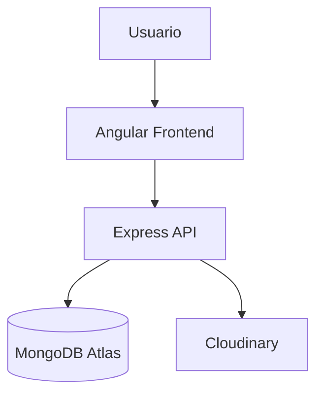

# 🌍 CityExplorer

Aplicación web para explorar, guardar y reseñar lugares de interés mediante una experiencia moderna e intuitiva.

  

## Estado del proyecto

✅ Completado

### Funcionalidades implementadas

- Autenticación JWT
- Gestión de lugares
- Sistema de reseñas
- Favoritos
- Subida de imágenes
- Filtros y búsqueda
- Despliegue en producción

## Problema

Encontrar lugares interesantes suele requerir consultar múltiples fuentes y aplicaciones.

CityExplorer centraliza la exploración, almacenamiento y compartición de lugares de interés en una sola plataforma.

## Objetivos

- Permitir descubrir lugares de interés.
- Compartir experiencias mediante reseñas.
- Guardar lugares favoritos.
- Aplicar buenas prácticas de desarrollo Full Stack.
- Implementar una arquitectura cliente-servidor escalable.

## Tecnologías

### Frontend
- Angular
- TypeScript
- Tailwind CSS
- DaisyUI

### Backend
- Node.js
- Express.js

### Base de datos y almacenamiento
- MongoDB Atlas
- Cloudinary

### Despliegue
- Vercel
- Render

## Capturas

### Pantalla de inicio

### Explorar lugares

### Detalles de lugar

### Favoritos

### Creación de lugar

### Modo oscuro

## Características técnicas

### Seguridad

- JWT Authentication
- Hash de contraseñas con bcrypt
- Middleware de autorización
- Validación de datos
- Helmet
- Rate Limiting
- CORS restringido

### Backend

- API REST
- Arquitectura por capas
- Controladores
- Middleware personalizado

### Base de datos

- MongoDB Atlas
- Modelado con Mongoose

## Estructura del proyecto

CityExplorer

├── frontend/angular-app
│   ├── src
│   ├── components
│   ├── services
│   └── pages
│
├── backend
│   ├── controllers
│   ├── routes
│   ├── middleware
│   ├── models
│   └── config
│
└── docs

## Retos técnicos

Durante el desarrollo se abordaron desafíos como:

- Integración entre Angular y Express.
- Gestión segura de autenticación mediante JWT.
- Almacenamiento de imágenes con Cloudinary.
- Diseño de filtros dinámicos.
- Despliegue distribuido en Vercel y Render.

## Demo en producción

🌐 Aplicación:
https://cityexplorer-gamma.vercel.app/

### Usuario de prueba

Correo:
front@test.com

Contraseña:
Solicitar acceso o crear cuenta propia.